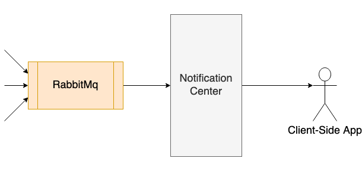

# NotificationCenter

This project has been prepared as a proof of concept to inform the user of system-wide events as soon as possible.

**RabbitMq** messaging system was used to monitor the events occurring throughout the system and MassTransit package was used to connect to RabbitMq.

Notifications were created from events that occurred and notifications are stored on **MongoDb**.

After the notifications are created, this information will be pushed to the **angular** application via the **SignalR** package.

## __RUN__

The project could be executed via _docker-compose_. 

In case of choosing this way to run the project, you can reach swagger screen via _http://localhost:5000_. You can use the endpoints under the `/test` route for creating system events. 

The welcome page will greet you when you browse the _http://localhost:4200_. When you type the name of a user, you can see the last 5 notifications of that person on the screen. When this page is open you post new events, notifications change automatically. Also, if you open two browsers and type the same username, if you change the notification status in one, it will change automatically in the other.

Note: Because the rabbit-mq needs more time to be ready compared to NotificationCenter-Api, it might take a while for you to reach the endpoints after `docker-compose up` command execution.

Note: If the `docker-compose up` command cannot be executed due to the port conflict, you should change the port information both from _docker-compose.yml_ and _appsettings.json_ file.

